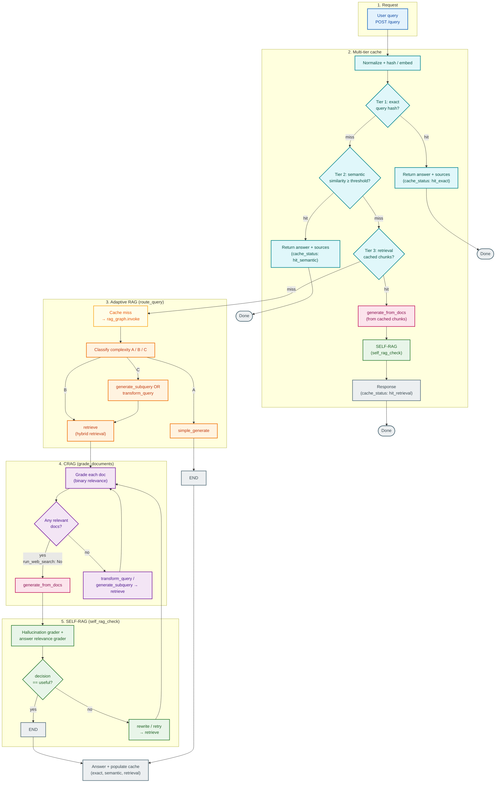

## RAG OPTMIZATION - ADAPTIVE RAG , CRAG , SELF RAG

An end-to-end, local-first Agentic RAG app with a FastAPI backend and a React (Vite) frontend. Upload a document once, then ask questions with traceable retrieval and caching.

**Highlights**
- Upload and ingest documents with Docling.
- Hybrid retrieval with Qdrant + BM25 and reranking (always on).
- Multi-tier caching (exact, semantic, retrieval) for faster responses.
- Simple React UI for upload, query, and diagnostics.

## Architecture (query flow)

`POST /query` checks a multi-tier cache first. On a full miss, the LangGraph in `src/graph.py` runs **Adaptive RAG** (`route_query`) → **CRAG** (`grade_documents`) → **SELF-RAG** (`self_rag_check`). A longer reference with the same diagram lives in [`diagram.md`](diagram.md).



| Color | Stage |
| --- | --- |
| Blue | Entry — user request |
| Teal | Cache — tiers and direct cache responses |
| Yellow | Cache miss — full pipeline |
| Orange | Adaptive RAG — A / B / C routing |
| Purple | CRAG — document grading and rewrite loops |
| Pink | Generation — `generate_from_docs` |
| Green | SELF-RAG — graders and retry |
| Gray | Terminal — end state and cache write |

**Notes:** Retrieval cache hits skip the full graph but still run generation + SELF-RAG. Path **A** (simple queries) skips retrieval, CRAG, and SELF-RAG in the graph.

## Quick Start

### Prerequisites
- Python 3.13+
- Node 18+ (for the UI)

### 1. Backend setup
```powershell
python -m venv .venv
.\.venv\Scripts\Activate.ps1
pip install -r requirements.txt
```

### 2. Start the API
```powershell
cd src
uvicorn src.main:app --reload --host 0.0.0.0 --port 8000
```

Health check:
```text
http://127.0.0.1:8000/health
```

### 3. Start the UI
```powershell
cd ui
npm install
npm run dev
```

Open:
```text
http://localhost:5173
```

Note: the UI currently calls the backend at `http://127.0.0.1:8000`.

## Configuration
Main config lives in `src/config.yaml`:

- `rag`: chunking and retrieval sizes.
- `embedding`: embedding model name.
- `reranker`: cross-encoder model name.
- `cache`: caching backend and thresholds.

Default embedding and reranker models:
- `sentence-transformers/all-MiniLM-L6-v2`
- `cross-encoder/ms-marco-MiniLM-L-6-v2`

The first run may download model weights from Hugging Face.

### Sample `.env`
Create a `.env` file in the project root if you use Vertex AI or other env-based config.

```env
# Vertex AI (used by litellm in src/config.yaml)
VERTEX_PROJECT=your-gcp-project-id
VERTEX_LOCATION=us-central1

# Optional: logging level
LOG_LEVEL=INFO
```

## API

Base URL: `http://127.0.0.1:8000`

### `POST /ingest`
Upload a file and build its index.

Request:
```bash
curl -X POST -F "file=@./path/to/file.pdf" http://127.0.0.1:8000/ingest
```

Response:
```json
{"file_id":"...","duplicate":false,"doc_name":"..."}
```

### `POST /query`
Ask a question about a previously ingested file.

Request:
```json
{"query":"What is this document about?","file_id":"<file_id>"}
```

Response:
```json
{
  "answer": "...",
  "decision": "B",
  "complexity": "B",
  "trace": [],
  "sources": [],
  "time_ms": 1234,
  "cache_status": "miss",
  "token_usage": {}
}
```

### `POST /cache/check`
Checks whether the query would hit cache.

### `POST /cache/clear`
Clears all caches.

### `GET /files`
Lists ingested files.

### `GET /health`
Simple health check.

## Project Structure

```
.
├─ src
│  ├─ main.py               # FastAPI app and endpoints
│  ├─ embedding.py          # Qdrant + BM25 + reranking
│  ├─ chunking.py           # Docling parsing + chunking
│  ├─ graph.py              # LangGraph orchestration
│  ├─ node.py               # Agentic steps and grading
│  └─ cache/                # Cache backends and utilities
├─ ui                        # React frontend
└─ data                      # Local runtime data (generated)
```

Generated data directories:
- `data/uploads` for uploaded files
- `data/bm25` for BM25 index pickles
- `data/ingestion_registry.json` for file metadata (kept in Git for reference)
- `qdrant_db` for Qdrant local store

Sample Docling output:
- `doc_output.json` is a sample Docling JSON artifact created by the CLI/demo scripts (for example, `python src/ingestion.py ...`). It is **not** created by the `/ingest` API path.

Registry files:
- `data/ingestion_registry.json` is intentionally **not** ignored so it can be inspected.
- `src/file_hash_registry.json` is a local CLI registry and **is** ignored in `.gitignore`.


## Troubleshooting

**UI says “Failed to fetch”**
- Ensure the backend is running on `http://127.0.0.1:8000`.
- Restart Vite after changes to `ui/src/App.tsx`.

**`ui:dist_not_found` warning**
- This is normal during local dev. The UI is served by Vite, not by `ui/dist`.

**Upload fails with a Docling or Hugging Face error**
- The first upload may download model weights.
- Check your internet connection and retry.
