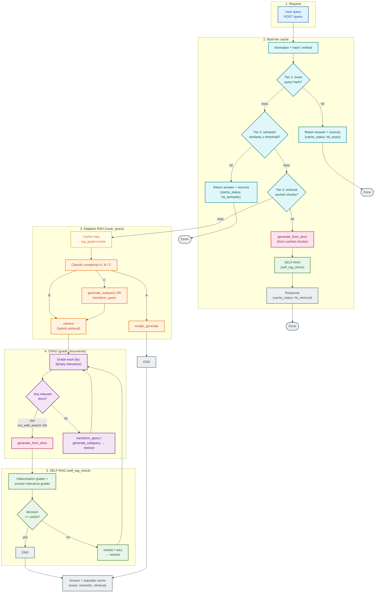

# Agentic RAG — project flow

Flow aligned with `/query` in `src/main.py` and the LangGraph in `src/graph.py`: multi-tier cache first; on full miss, **Adaptive RAG** → **CRAG** (`grade_documents`) → **SELF-RAG** (`self_rag_check`).

## Color legend

| Color | Meaning |
| --- | --- |
| Blue | **Entry** — user request |
| Teal | **Cache** — normalize, tiers, direct cache responses |
| Yellow | **Cache miss** — full pipeline |
| Orange | **Adaptive RAG** — routing A / B / C |
| Purple | **CRAG** — grade documents, rewrite / retry loops |
| Pink | **Generation** — `generate_from_docs` |
| Green | **SELF-RAG** — critique and retry decisions |
| Gray | **Terminal** — end states, final response, cache write |

## Notes

- **Cache** tiers: exact → semantic → retrieval. Retrieval hits still run `generate_from_docs` + **SELF-RAG** (no full graph).
- **Adaptive RAG** is `route_query` and A/B/C routing in `graph.py`.
- **CRAG** is `grade_documents`; irrelevant docs trigger rewrite/subquery loops.
- **SELF-RAG** is `self_rag_check` after generation; path **A** skips retrieval, grading, and self-check in the graph.
